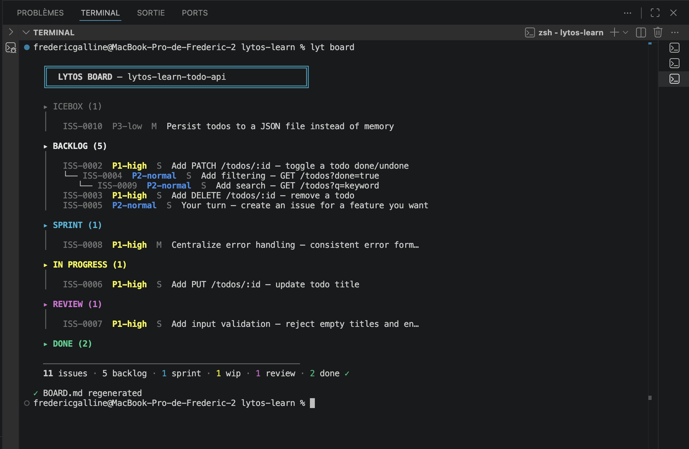
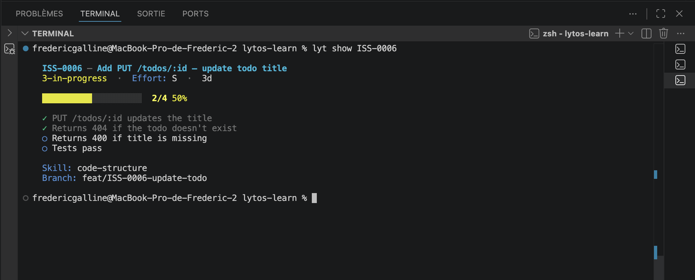
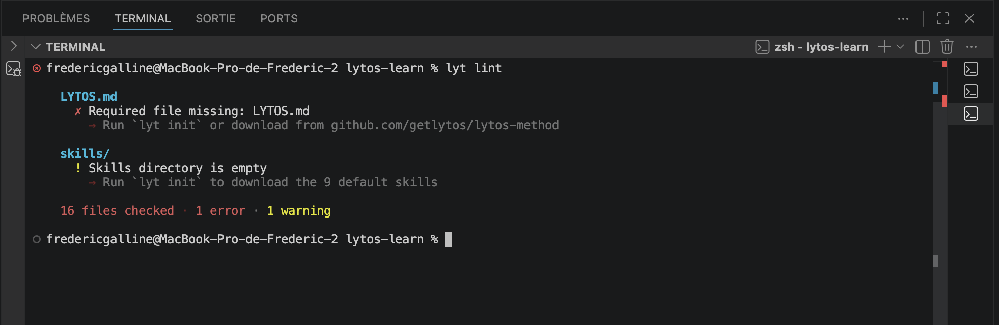
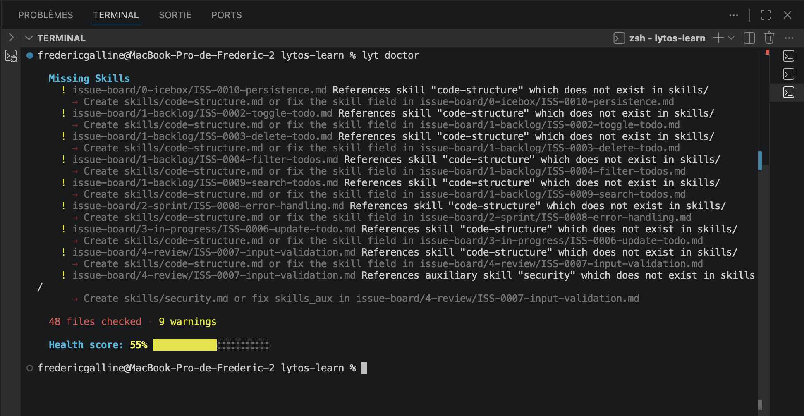

# Lytos CLI

[](https://www.npmjs.com/package/lytos-cli)
[](https://github.com/getlytos/lytos-cli/actions/workflows/ci.yml)

> The command-line tool for [Lytos](https://lytos.org) — a human-first method for working with AI coding agents.

**[Documentation — lytos.org](https://lytos.org)** · **[The method](https://github.com/getlytos/lytos-method)** · **[Lire en français](./docs/fr/README.md)**

---

## Do you develop with AI?

You switch models. You open a new session. You go from Claude to Codex.
And each time, the same ritual: re-supply the context, repeat the conventions, correct the same drifts.

Meanwhile, the debt sets in. Today's generated code no longer matches yesterday's. Conventions slip. The project grows faster than the AI's ability to find its way in it.

Many have come to accept this friction as normal. It isn't.

**Lytos addresses this by anchoring the context where it belongs: in the repo.**

---

## Who it's for

| Profile | Typical setup | What Lytos brings |
|---|---|---|
| **Vibe-coder / maker** | Claude Code, Codex, AI apps + GitHub | A manifest the AI reads every session. Less re-explaining, a context that compounds. |
| **Developer** | IDE + Git (GitHub / GitLab) + AI as a tool | Versioned rules, a memory that builds, a board that traces the work — in the repo, not in a SaaS. |
| **Team** | IDE + Git + CI + reviews + product ticketing | Shared manifest, skills, rules. The AI produces in the project's style. Technical specs for the AI live in the repo, next to the code. |

---

## Install

```bash
npm install -g lytos-cli
lyt init
```

Or without installing:

```bash
npx lytos-cli init
```

In 2 minutes, your repo has its manifest, rules, and board. From there, the AI knows your project.

### Mixed-team setup: one repo, several AI tools

On a repo where some developers use Claude Code, others Cursor, others Codex, `lyt init` can scaffold every bridge file in one shot:

```bash
lyt init --tool claude,cursor,copilot       # CSV: only what the team uses
lyt init --all-tools                        # every shipping adapter at once
```

Every bridge points at the same `.lytos/` directory, so switching tools does not require reconfiguring the project. `none` is accepted in the list as a no-op, so scripts can pass `"none,claude"` without a special case. Unknown values exit with an error before any file is written.




---

## Commands

| Command | What it does |
|---------|-------------|
| `lyt init` | Scaffold `.lytos/` in a project (interactive, detects the stack) |
| `lyt board` | Regenerate BOARD.md from issue YAML frontmatter |
| `lyt archive` | Move completed issues from `5-done/` to `archive/<quarter>/` (default: older than 7 days). `--all`, `--older-than <Nd>`, `--dry-run` |
| `lyt lint` | Validate `.lytos/` structure and content |
| `lyt doctor` | Full diagnostic — broken links, stale memory, missing skills, health score |
| `lyt show [ISS-XXXX]` | Display issue detail with progress bar, or all in-progress issues |
| `lyt start ISS-XXXX` | Start an issue — move to in-progress, create branch, update board |
| `lyt close ISS-XXXX` | Close one issue — promote to `5-done` from `4-review` (or explicitly from in-progress), warns about unchecked items |
| `lyt close` | Batch-close every issue in 4-review/ → 5-done/ (asks to confirm; `--yes` skips the prompt; `--dry-run` previews) |
| `lyt upgrade` | Pull the latest method files into `.lytos/`. `--migrate-cursor` converts a legacy `.cursorrules` to `.cursor/rules/lytos.mdc`. |
| `lyt update` | Update lytos-cli to the latest version |



---

## What `lyt init` generates

```
project/
└── .lytos/
    ├── manifest.md              # Intent — project identity and constraints
    ├── LYTOS.md                 # Method reference
    ├── config.yml               # Language and profile preferences
    ├── skills/                  # Design — Lytos protocol + agentskills.io task skills
    │   ├── session-start.md     # Lytos bootstrap protocol (flat)
    │   ├── code-structure/SKILL.md
    │   ├── code-review/SKILL.md
    │   ├── testing/SKILL.md
    │   ├── documentation/SKILL.md
    │   ├── git-workflow/SKILL.md
    │   ├── deployment/SKILL.md
    │   ├── security/SKILL.md
    │   └── api-design/SKILL.md  # 8 task skills (agentskills.io format)
    ├── rules/                   # Standards — quality criteria
    │   └── default-rules.md
    ├── issue-board/             # Progress — kanban board
    │   ├── BOARD.md
    │   ├── 0-icebox/
    │   ├── 1-backlog/
    │   ├── 2-sprint/
    │   ├── 3-in-progress/
    │   ├── 4-review/
    │   └── 5-done/
    ├── memory/                  # Memory — accumulated knowledge
    │   ├── MEMORY.md
    │   └── cortex/
    └── templates/               # Issue and sprint templates
```

`lyt init` also detects the project's stack (language, framework, test runner, package manager) and pre-fills the manifest. It generates the appropriate adapter file for the chosen AI tool — `CLAUDE.md`, `.cursor/rules/lytos.mdc`, `AGENTS.md`, `.github/copilot-instructions.md`, `GEMINI.md`, or `.windsurfrules`.

A pre-commit hook is installed to enforce branch naming conventions (`type/ISS-XXXX-slug`). This prevents untracked work on `main` — regardless of which AI tool or model is used.

### Startup depth — lightweight vs standard

The `session-start` skill reads the current issue's frontmatter to decide how much context the AI loads before starting.

- **Lightweight startup** is allowed only when the issue is explicitly `effort: XS` **and** `complexity: light`. The AI still loads the mandatory safety baseline (manifest, MEMORY, default rules, BOARD, the issue itself), but defers cortex notes, project-specific rule files, and broad codebase exploration until the issue clearly needs them.
- **Standard startup** remains mandatory for every other combination. If either field is missing, the AI defaults to standard. If the task grows mid-session, it immediately upgrades from lightweight to standard.

This is how small issues stay fast without burning the context window, and why `effort` and `complexity` in issue frontmatter are load-bearing — they are not just prioritization hints.

### Customized bridge files are preserved

Running `lyt init --force` on an existing project re-scaffolds `.lytos/` without overwriting any local customization you added to your AI bridge file (`CLAUDE.md`, `.cursor/rules/lytos.mdc`, `AGENTS.md`, `.github/copilot-instructions.md`, `GEMINI.md`, `.windsurfrules`). If the bridge already exists, it is kept as-is and the CLI prints a warning so you know it was skipped.

To explicitly replace a bridge with the bundled template — useful when upstreaming a new default or when your local copy has drifted — pass `--overwrite-bridges`:

```bash
lyt init --force                          # re-scaffold, preserve bridges (default)
lyt init --force --overwrite-bridges      # re-scaffold, replace bridges too
```

---

## Works with any AI tool

| Tool | What `lyt init` generates |
|------|--------------------------|
| **Claude Code** | `CLAUDE.md` at project root |
| **Cursor** | `.cursor/rules/lytos.mdc` (modern Cursor rule with YAML front-matter) |
| **Codex (OpenAI)** | `AGENTS.md` at project root |
| **GitHub Copilot** | `.github/copilot-instructions.md` |
| **Gemini CLI** | `GEMINI.md` at project root |
| **Windsurf** | `.windsurfrules` at project root |
| **Others** | The `.lytos/` directory is plain Markdown — any LLM can read it |

> *"Choose your AI. Don't belong to it."*

---

## Design principles

- **Offline-first** — `lyt lint`, `lyt doctor`, `lyt board`, `lyt show`, `lyt start`, `lyt close` never need network
- **Zero lock-in** — plain Markdown files, portable across any AI tool
- **No telemetry** — no tracking, no analytics, ever. Opt-out for update check: `LYT_NO_UPDATE_CHECK=1`
- **Human-first** — the human defines the method, the AI follows it
- **Fail with context** — when something is wrong, the CLI says what, where, and how to fix it




---

## Built with Lytos

This CLI is developed using Lytos itself. The `.lytos/` directory in this repository contains the real manifest, sprint, issues, and memory — not templates. Every feature was tracked as an issue, started with `lyt start`, and closed with `lyt close`.

[Browse the issue board →](.lytos/issue-board/BOARD.md)

---

## Links

- **Documentation** — [lytos.org](https://lytos.org)
- **Tutorial** — [lytos-learn](https://github.com/getlytos/lytos-learn) — learn by doing in 7 steps
- **The method** — [github.com/getlytos/lytos-method](https://github.com/getlytos/lytos-method)
- **npm** — [npmjs.com/package/lytos-cli](https://www.npmjs.com/package/lytos-cli)

---

## Author

Created by **Frederic Galliné**

- GitHub: [@FredericGalline](https://github.com/FredericGalline)
- X: [@fred](https://x.com/fred)

---

## License

MIT — see [LICENSE](./LICENSE)

---

## Star history

[](https://www.star-history.com/#getlytos/lytos-cli&getlytos/lytos-method&Date)
